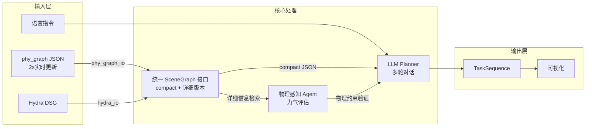

# phy_plan 高层规划框架

## 项目核心 Contribution

**Dynamic Scene Graph + Physics-Aware Planning**

- 动态场景图实时更新（2s周期）✅
- 物理属性感知的任务规划（力气 vs weight_level）
- 多轮对话支持动态重规划 ✅
- 实时场景图订阅 + 环境变化检测 ✅

## 研究动机

### 现有 LLM 规划系统的局限

大多数基于场景图的 LLM 规划系统（如 ConceptGraphs, DC-SGG）仅关注**语义理解**：
- ✅ "找到杯子" ✅ "导航到厨房"
- ❌ "杯子太重，机器人搬不动" ❌ "桌子被固定，无法推动"

**问题**：忽略了**物理属性**，导致生成的计划在真实世界中不可执行。

### 我们的创新

将 **物理感知** 引入 LLM 任务规划：
1. **场景图增强**：每个物体包含 `weight_level`, `pushable`, `friction_level`（通过 `phy_graph` VLM 推断）
2. **结构化物理描述**：VLM 输出遵循 `[appearance] ; [spatial] ; [context]` 格式，预定义 10 种空间关系类型
3. **物理约束验证**：LLM 生成计划后，Python 快速验证物理可行性
4. **动态重规划**：环境变化时自动更新场景图并重规划

**示例对比**：
```
指令: "把桌子推到窗边"

❌ 传统方法:
  1. [NAVIGATE] Navigate to table
  2. [PUSH] Push table to window
  ⚠️ 失败: 桌子太重或被固定

✅ 我们的方法:
  1. PhysicsAwareAgent 检测: table.pushable = False
  2. 返回 LLM: "桌子无法推动，请重新规划"
  3. LLM 重规划: "抱歉，桌子无法移动。我可以帮您把椅子移到窗边。"
```

## 设计哲学

### 感知层：Hydra DSG
- **选择理由**: 业界流式 3D 场景图构建的最佳实践，实时性能优异
- **优势**: 稳定可靠、2s 更新周期、已在多个机器人项目验证
- **vs Open-vocabulary 方法** (ConceptGraphs, DovSG): 
  - 不追求感知层创新，专注于**规划层物理感知**
  - Hydra 的成熟度和实时性更适合动态重规划

### 规划层：LLM 直接生成 + 物理约束验证
- **选择理由**: 
  - LLM 直接生成 Action Sequence，灵活高效
  - 物理约束通过 Python 后置验证，无需重量级 PDDL 规划器
  - 支持多轮对话和动态重规划
  
- **vs PDDL 方法** (DC-SGG, LLM-Scene-Graph-LTL-Planning):
  - PDDL: 形式化保证强，但表达力受限、动态重规划慢
  - **我们的方法**: LLM 灵活生成 + 物理约束快速验证
  - **创新点**: 物理属性作为后置过滤而非前置约束建模

**核心贡献**: 首个结合 **物理属性感知** 和 **动态场景图订阅** 的 LLM 任务规划系统

### VLM 物理属性推断（phy_graph 创新）

**结构化输出格式**：
```
"description": "[appearance] red, ceramic, cylindrical ; [spatial] on(table), near(keyboard) ; [context] likely a coffee mug"
```

**预定义空间关系类型**（10种）：
```python
["on", "under", "inside", "attached_to", "left_of", "right_of", "front_of", "behind", "near", "touching"]
```

**物理属性**：
| 属性 | 类型 | 说明 |
|------|------|------|
| `weight_level` | 0/1/2 | 轻/中/重 |
| `pushable` | 0/1 | 是否可推动 |
| `friction_level` | 0/1/2 | 摩擦系数等级 |
| `estimated_weight_kg` | string | 重量估计范围（如 "5-10"）|

**优势**：
- ✅ 结构化格式便于解析（正则表达式即可）
- ✅ 预定义关系类型保证输出一致性
- ✅ 空间关系可直接用于任务规划

## 架构概览



## 📁 目录结构

```
phy_plan/
├── __init__.py
├── core/                     # 🧠 核心组件
│   ├── __init__.py
│   ├── agent.py              # ✅ LLM Agent 封装（单轮/多轮对话）
│   ├── scene_graph.py        # ✅ 统一接口 + to_compact_json() + to_verbose_description()
│   └── task.py               # ✅ 领域语言（Action, TaskSequence）
├── input/                    # 📥 数据输入
│   ├── __init__.py
│   ├── phy_graph_io.py       # ✅ 加载 phy_graph JSON（静态）
│   ├── phy_graph_subscriber.py # ✅ ROS 订阅器（实时/文件模式）⭐ Phase 2
│   └── hydra_io.py           # ✅ 加载 Hydra DSG（含 GVD places）
├── planner/                  # 🗺️ 规划器
│   ├── __init__.py
│   ├── llm_planner.py        # ✅ LLM 规划器（支持歧义澄清）⭐ Phase 1
│   └── llm_planner_pipeline.py # ✅ 完整 Pipeline（交互式循环）⭐ Phase 1-2
├── prompts/                  # 💬 提示词工程
│   ├── __init__.py
│   └── task_planning_prompt.py # ✅ Prompt 模板（few-shot + 歧义处理）
├── output/                   # 📤 输出结果
│   ├── __init__.py
│   └── task_sequence.py
├── visualization/            # 🎨 可视化
│   ├── __init__.py
│   └── arrangement_viz.py    # ✅ 2D 可视化 + 动画
├── utils/                    # 🛠️ 工具函数
│   ├── assignment.py         # ✅ 匈牙利算法 + TSP
│   └── arrangement.py        # ✅ 位置生成
├── experiments/              # 🧪 实验脚本
│   ├── chair_arrangement.py  # ✅ 椅子摆放实验
│   ├── task_demo.py          # ✅ LLM 规划 Demo
│   ├── interactive_demo.py   # ✅ 交互式规划 Demo（Phase 1-2）⭐
│   └── data/
│       └── test_scene_coffee.json # ✅ 测试场景
└── test/                     # 🧪 单元测试
```

## Compact vs 详细版本设计

**设计目的**：节省 LLM token，同时支持详细信息检索

```
Compact 版本（用于 LLM prompt）     详细版本（用于检索）
─────────────────────────────────────────────────────────
{                                   {
  "node_id": "O(13)",                "node_id": "O(13)",
  "category": "chair",               "category": "chair",
  "room_id": "R(2)"                  "position": {"x": 1.5, "y": 2.0, "z": 0.5},
}                                    "bounding_box": {...},
                                     "physical_properties": {
                                       "weight_level": 1,
                                       "pushable": true,
                                       "friction_level": 1
                                     }
                                   }
```

**流程**：
1. `to_compact_json()` 生成 prompt → LLM 输出引用 `node_id`
2. 解析后从完整 SceneGraph 检索 `position`, `bounding_box`, `physical_properties`

## 🚀 快速开始

### 方式 1: 交互式规划（Phase 1-2 新增）✨

#### 离线测试（无需 ROS）
适合快速体验、Demo 演示、无 ROS 环境
```bash
cd /home/kamwing/catkin_ws/src/phy_plan
export OPENAI_API_KEY='your-key'
python phy_plan/experiments/interactive_demo.py
```

#### ROS 实时模式
适合真实机器人实验、动态环境测试
```bash
# 终端 1: 启动 phy_graph (发布场景图到 /phy_graph/scene_graph_full)
roslaunch phy_graph inference.launch

# 终端 2: 启动交互式规划器
cd /home/kamwing/catkin_ws/src/phy_plan
python phy_plan/experiments/interactive_demo.py --ros
```

#### 预期交互流程
```
========================================
交互式任务规划系统 (Phase 1-2)
- 多轮对话支持
- 实时场景图订阅
- 环境变化检测
========================================

请输入任务指令: 拿水杯

🔍 检测到环境变化，已更新场景图
🤖 Robot: 我发现了 2 个杯子，请问是哪一个？
候选项:
  1. coffee_cup (O(5)) 位于 Kitchen
  2. water_cup (O(8)) 位于 LivingRoom

请回答: 第一个

✅ 生成计划成功:
  Step 1: [NAVIGATE] Navigate to Kitchen
  Step 2: [PICK] Pick up O(5) (coffee_cup)
  Step 3: [NAVIGATE] Navigate to user location

是否执行此计划? (y/n): y
[执行中...]
```

### 方式 2: 单次规划（原有方式）

适合批量测试、基准评估

```bash
# 离线测试（不调用 LLM）
cd /home/kamwing/catkin_ws/src/phy_plan
python phy_plan/experiments/task_demo.py --offline

# 完整测试
export OPENAI_API_KEY='your-key'
python phy_plan/experiments/task_demo.py \
    --scene phy_plan/experiments/data/test_scene_coffee.json \
    --instruction "去小房间拿咖啡杯到大会议室，然后整理椅子"
```

---

## 实现路线图

### ✅ Phase 0: 基础框架（已完成）

- [x] 单轮 LLM 调用 (`core/agent.py`)
- [x] Compact JSON 生成 (`scene_graph.to_compact_json()`)
- [x] Prompt 模板 + few-shot (`prompts/task_planning_prompt.py`)
- [x] LLM Planner + Pipeline (`planner/`)
- [x] 离线测试 Demo (`experiments/task_demo.py`)
- [x] 椅子摆放实验 (`experiments/chair_arrangement.py`)

### ✅ Phase 1: 多轮对话支持（已完成）

**实现内容**：
- [x] 对话历史管理 (`LLMAgent.chat()`, `init_conversation()`, `reset()`)
- [x] 歧义澄清机制 (`ClarificationRequest` 数据类)
- [x] 交互式 Pipeline (`run_interactive()` 循环)
- [x] Prompt 更新（支持 `clarification_needed` 字段）

**关键文件**：
- `phy_plan/core/agent.py` - 添加多轮对话方法
- `phy_plan/prompts/task_planning_prompt.py` - 更新 Prompt 支持歧义处理
- `phy_plan/planner/llm_planner.py` - 添加 `ClarificationRequest` 和解析逻辑
- `phy_plan/planner/llm_planner_pipeline.py` - 实现 `run_interactive()`
- `phy_plan/experiments/interactive_demo.py` - 交互式 Demo

**使用示例**：
```python
from phy_plan.core.agent import LLMAgent

agent = LLMAgent(model="gpt-4o-mini")
agent.init_conversation("You are a helpful assistant.")
response = agent.chat("What is your name?")
agent.reset()
```

### ✅ Phase 2: 实时 phy_graph 对接（已完成）

**实现内容**：
- [x] C++ ROS 发布者 (`/phy_graph/scene_graph_full` 话题)
- [x] Python 订阅器 (`SceneGraphSubscriber` 类)
- [x] Fallback 文件模式支持
- [x] 简化版环境变化检测（哈希比较）

**关键文件**：
- `phy_graph/include/phy_graph/graph_generator.h` - 添加 `scene_graph_pub_`
- `phy_graph/src/graph_generator_node.cpp` - 初始化并发布场景图
- `phy_plan/input/phy_graph_subscriber.py` - ROS 订阅器实现

**使用示例**：
```python
from phy_plan.input.phy_graph_subscriber import SceneGraphSubscriber

# ROS 实时模式
subscriber = SceneGraphSubscriber(topic="/phy_graph/scene_graph_full")
scene_graph = subscriber.get_latest()

# 文件 fallback 模式
subscriber = SceneGraphSubscriber.from_file("scene.json")
scene_graph = subscriber.get_latest()
```

**改进计划**：两级细粒度变化检测
```python
# 未来升级：_check_scene_change_advanced()
# Level 1: 存在性检测
#   - 检测新增物体: "新增物体: O(15) chair"
#   - 检测删除物体: "移除物体: O(3) cup"
# 
# Level 2: 位置检测（仅对仍存在的物体）
#   - 检测房间变化: "chair (O(13)) 从 Kitchen 移动到 LivingRoom"
#   - 检测坐标变化: "table (O(5)) 位置偏移 0.5m"
#
# 当前实现：简化版（哈希比较 + 物体数量变化）
```

### 🔄 Phase 3: 物理感知 Agent（核心创新）

**目标**：轻量级物理约束验证（无需 PDDL）

**设计理念**：
- LLM 生成候选计划 → Python 快速验证 → 不可行时重新询问
- 对比 PDDL：无需预先建模所有约束，动态响应更灵活

```python
# core/physics_agent.py
@dataclass
class RobotCapability:
    max_force: int = 2          # 最大力气等级 0-2 (0=纸片人, 1=普通, 2=大力士)
    gripper_width: float = 0.1  # 夹持宽度 (米)
    reach_distance: float = 1.0 # 可达距离 (米)

class PhysicsAwareAgent:
    def __init__(self, capability: RobotCapability):
        self.capability = capability
        
    def can_manipulate(self, obj: ObjectNode) -> bool:
        """判断能否操作物体（后置验证）"""
        if not obj.physical_properties:
            return True  # 无物理属性则假设可操作
        
        props = obj.physical_properties
        
        # 重量检查
        if props.weight_level > self.capability.max_force:
            return False, f"{obj.category} 太重 (weight_level={props.weight_level})"
        
        # 可推动性检查（如果是 PUSH 动作）
        if not props.pushable and action_type == "PUSH":
            return False, f"{obj.category} 无法推动"
        
        return True, None
        
    def validate_plan(self, task_seq: TaskSequence, sg: SceneGraph) -> Tuple[bool, str]:
        """验证整个计划的物理可行性"""
        for action in task_seq.actions:
            if action.action_type in ["PICK", "PLACE", "PUSH"]:
                obj = sg.get_object_by_id(action.object_id)
                is_valid, reason = self.can_manipulate(obj)
                if not is_valid:
                    return False, f"Step {action.step_id} 失败: {reason}"
        return True, None
```

**物理约束规则**：
- `weight_level > robot.max_force` → ❌ 无法搬运 → 🔁 LLM 重新规划（找更轻的物体或请求帮助）
- `pushable == False` → ❌ 无法推动 → 🔁 LLM 改用 PICK 或 NAVIGATE 绕行
- `friction_level` → ⚠️ 影响推动策略（Phase 4 扩展）

**工作流程**：
```
用户指令 → LLM 生成计划 → PhysicsAwareAgent 验证
                                  ↓
                    ✅ 可行 → 执行
                    ❌ 不可行 → 返回原因 → LLM 重新规划
```

### 🔄 Phase 4: 动态重规划 Pipeline（核心创新）

**目标**：场景变化时自动重规划（结合 Phase 2 的 `_check_scene_change()`）

```python
# planner/dynamic_planner.py
class DynamicPlannerPipeline:
    def __init__(self, agent, phy_graph_sub, robot_capability):
        self.agent = agent
        self.phy_graph_sub = phy_graph_sub
        self.physics_agent = PhysicsAwareAgent(robot_capability)
        self._current_plan = None
        self._execution_index = 0
        
    def plan_and_monitor(self, instruction):
        """规划并监控执行（集成物理验证）"""
        # 1. 初始规划
        self._current_plan, _ = self.planner.plan(instruction, self.scene_graph)
        
        # 2. 物理可行性验证
        is_valid, reason = self.physics_agent.validate_plan(self._current_plan, self.scene_graph)
        if not is_valid:
            print(f"⚠️ 计划不可行: {reason}")
            # 多轮对话重新规划
            return self.replan_with_constraint(reason)
        
        # 3. 执行并监控
        while not self.is_complete():
            # 3.1 检查场景图是否有重大变化
            self._update_scene_graph()
            if self._check_scene_change():
                print("🔄 检测到环境变化，重新规划...")
                self._current_plan = self.replan_with_context()
            
            # 3.2 执行下一个动作
            action = self._current_plan.actions[self._execution_index]
            success = self.execute_action(action)
            
            if not success:
                print(f"❌ 动作失败: {action}")
                # 失败重规划
                self._current_plan = self.replan_with_failure(action)
            else:
                self._execution_index += 1
        
        return True
```

**动态重规划触发条件**：
1. **环境变化** (`_check_scene_change()` 返回 True)
   - 物体新增/删除
   - 物体位置变化（未来扩展）
2. **物理约束违反** (`validate_plan()` 返回 False)
   - 运行时发现物体太重
   - 路径被阻挡
3. **执行失败** (夹取失败、导航失败等)

---

## 🔮 未来升级方向

### 1. 细粒度场景变化检测（Phase 2 扩展）
```python
# 当前：简化版（哈希 + 物体数量）
def _check_scene_change(self):
    return self._previous_scene_hash != current_hash

# 未来：两级检测
def _check_scene_change_advanced(self):
    # Level 1: 存在性检测
    added = new_objects - old_objects
    removed = old_objects - new_objects
    
    # Level 2: 空间关系检测
    for obj_id in common_objects:
        if obj.room_id != old_obj.room_id:
            print(f"{obj.category} 从 {old_room} 移动到 {new_room}")
```

### 2. GVD Places 导航路径规划
利用 Hydra DSG 的 Places 层进行几何拓扑导航（已有 `hydra_io.py` 支持）
```python
from phy_plan.input.hydra_io import load_hydra_dsg

dsg = load_hydra_dsg("path/to/dsg.json")
places = dsg.get_places_layer()
path = find_gvd_path(start_room, goal_room, places)
```

### 3. 3D 点云 LLM（SpatialLM 启发）
- 当前：仅使用 2D bounding box + room_id
- 未来：将物体点云编码为 LLM 输入，增强 3D 空间推理能力

### 4. 主动探索未知环境（DovSG 启发）
- 当前：假设场景图完整
- 未来：检测到物体缺失时，主动导航到可能位置搜索

### 5. PDDL/LTL 混合规划（可选）
- 保留 LLM 灵活性的同时，对关键约束（如安全、时序）引入形式化验证
- 参考 Context-Matters 的 LLM → PDDL 转换思路

---

## 📊 实现进度

| 阶段 | 依赖 | 状态 | 关键文件 |
|------|------|------|----------|
| Phase 0<br/>基础框架 | - | ✅ 完成 | `agent.py`, `scene_graph.py`, `llm_planner.py` |
| Phase 1<br/>多轮对话 | Phase 0 | ✅ 完成 | `agent.chat()`, `ClarificationRequest` |
| Phase 2<br/>实时订阅 | Phase 0 | ✅ 完成 | `phy_graph_subscriber.py`, `run_interactive()` |
| Phase 3<br/>物理感知 | Phase 1-2 | 🔄 待实现 | `physics_agent.py`, `validate_plan()` |
| Phase 4<br/>动态重规划 | Phase 1-3 | 🔄 待实现 | `plan_and_monitor()` |

---

## API 使用示例

### 1. 使用 SceneGraphSubscriber

```python
from phy_plan.input.phy_graph_subscriber import SceneGraphSubscriber

# ROS 实时模式
subscriber = SceneGraphSubscriber(topic="/phy_graph/scene_graph_full")
scene_graph = subscriber.get_latest()

# 文件 fallback 模式
subscriber = SceneGraphSubscriber.from_file("scene.json")
scene_graph = subscriber.get_latest()
```

### 2. 使用多轮对话

```python
from phy_plan.core.agent import LLMAgent

agent = LLMAgent(model="gpt-4o-mini")

# 初始化对话
agent.init_conversation("You are a helpful assistant.")

# 多轮对话
response1 = agent.chat("What is your name?")
response2 = agent.chat("Tell me a joke.")

# 重置对话
agent.reset()
```

### 3. 使用 Interactive Pipeline

```python
from phy_plan.planner.llm_planner_pipeline import LLMPlannerPipeline
from phy_plan.input.phy_graph_subscriber import SceneGraphSubscriber

# 文件模式
pipeline = LLMPlannerPipeline(scene_file="scene.json")
task_seq = pipeline.run_interactive(initial_instruction="拿水杯")

# ROS 实时模式
subscriber = SceneGraphSubscriber()
pipeline = LLMPlannerPipeline(subscriber=subscriber)
task_seq = pipeline.run_interactive()
```

---

## ⚙️ 编译和运行

### 1. 安装依赖

```bash
# Python 依赖（推荐使用虚拟环境）
cd /home/kamwing/catkin_ws/src/phy_plan
pip install -r requirements.txt

# ROS 依赖（如果使用 ROS 模式）
sudo apt install ros-noetic-std-msgs
```

### 2. 编译 C++ 代码（仅 Phase 2 ROS 模式需要）

如果修改了 `phy_graph` 的 C++ 代码，需要重新编译：

```bash
cd /home/kamwing/catkin_ws
catkin build phy_graph
source devel/setup.bash
```

### 3. 设置环境变量

```bash
# OpenAI API（推荐 GPT-4o-mini，便宜且效果好）
export OPENAI_API_KEY='sk-xxx'

# 或使用 OpenRouter（支持更多模型）
export OPENAI_API_BASE='https://openrouter.ai/api/v1'
export OPENROUTER_API_KEY='sk-or-xxx'

# ROS 环境（ROS 模式需要）
source /opt/ros/noetic/setup.bash
source /home/kamwing/catkin_ws/devel/setup.bash
```

### 4. 验证安装

```bash
# 测试 Python 导入
python -c "from phy_plan.core.agent import LLMAgent; print('✅ phy_plan 安装成功')"

# 测试 ROS 话题（ROS 模式）
rostopic list | grep scene_graph
# 应该看到: /phy_graph/scene_graph_full
```

---

## 🐛 故障排除

### 问题 1: "No scene graph loaded"
**症状**: Pipeline 启动后报错 "No scene graph loaded"

**可能原因**:
- 文件模式：场景图文件不存在或路径错误
- ROS 模式：`phy_graph` 节点未启动或未发布数据

**解决方法**:
```bash
# 文件模式
ls phy_plan/experiments/data/test_scene_coffee.json  # 确认文件存在

# ROS 模式
rosnode list | grep phy_graph  # 确认节点运行
rostopic echo /phy_graph/scene_graph_full --noarr  # 确认数据发布
```

### 问题 2: "API key not found"
**症状**: 调用 LLM 时报错 "API key not found"

**解决方法**:
```bash
# 检查环境变量
echo $OPENAI_API_KEY

# 如果为空，设置环境变量
export OPENAI_API_KEY='sk-xxx'
```

### 问题 3: rospy 导入失败
**症状**: `ImportError: No module named rospy`

**可能原因**: 不在 ROS 环境中

**解决方法**:
```bash
# 方案 1: 使用文件模式（无需 ROS）
python phy_plan/experiments/interactive_demo.py  # 自动使用文件 fallback

# 方案 2: 设置 ROS 环境
source /opt/ros/noetic/setup.bash
```

### 问题 4: LLM 返回格式错误
**症状**: `JSONDecodeError` 或 "Invalid LLM response format"

**可能原因**: 
- LLM 模型版本不支持（如 GPT-3.5-turbo 不稳定）
- Prompt 被截断

**解决方法**:
```python
# 使用更强模型（在 agent.py 修改）
agent = LLMAgent(model="gpt-4o")  # 替代 gpt-4o-mini

# 或减少场景图大小
compact_json = scene_graph.to_compact_json(max_objects=50)
```

### 问题 5: 场景图更新但未触发重规划
**症状**: ROS 模式下场景变化，但 `_check_scene_change()` 未检测到

**可能原因**: 哈希冲突或仅有微小变化（如坐标偏移 0.01m）

**解决方法**:
```python
# 临时调试：打印哈希值
print(f"Previous: {self._previous_scene_hash}")
print(f"Current: {current_hash}")

# 未来升级：使用细粒度检测（Phase 2 扩展）
```

---

## 相关工作对比

| 项目 | 感知层 | 规划层 | 动态性 | 物理感知 |
|------|--------|--------|--------|----------|
| **phy_plan (Ours)** | ✅ Hydra DSG<br/>(2s 实时更新) | ✅ LLM 直接生成<br/>+ 物理约束验证 | ✅ 多轮对话<br/>+ 动态重规划 | ✅ 重量/摩擦/可推动性 |
| [**ConceptGraphs**](https://concept-graphs.github.io/) | Open-vocabulary<br/>3D Scene Graph | ✖️ 无规划 | ✖️ 离线构建 | ✖️ 无物理属性 |
| [**DovSG**](https://github.com/gaoalexander/DovSG) | Open-vocabulary<br/>+ Active Exploration | ✖️ 无规划 | 部分<br/>(主动探索) | ✖️ 无物理属性 |
| [**DC-SGG**](https://github.com/joyhsu0504/DC-SGG) | LLaVA 图像标注 | PDDL 规划器 | ✖️ 单次规划 | ✖️ 无物理属性 |
| [**LLM-SG-LTL**](https://github.com/Charlie0257/LLM-Scene-Graph-LTL-Planning) | 手动构建场景图 | LTL + STL 形式化 | ✖️ 单次规划 | ✖️ 无物理属性 |
| [**Context-Matters**](https://github.com/Learning-and-Intelligent-Systems/context-matters) | 图像描述 | LLM 生成 PDDL | ✖️ 单次规划 | ✖️ 无物理属性 |
| [**SpatialLM**](https://github.com/zsyzzsoft/SpatialLM) | 点云 + LLM | 3D 推理问答 | ✖️ 问答系统 | ✖️ 无物理属性 |

### 我们的独特优势

1. **首个结合物理感知的 LLM 规划系统**
   - 其他方法仅关注**语义**（"找杯子"），忽略**物理**（"杯子太重"）
   - 我们通过 `weight_level`, `pushable`, `friction_level` 实现物理约束

2. **实时动态场景图订阅**
   - ConceptGraphs/DovSG 是离线构建场景图
   - 我们用 Hydra 的流式更新 (2s 周期) + 环境变化检测

3. **轻量级 LLM 规划**
   - DC-SGG/LLM-SG-LTL 需要重量级 PDDL/LTL 规划器
   - 我们用 LLM 直接生成 + Python 快速验证，支持快速重规划

4. **多轮对话澄清**
   - 其他方法假设指令明确，遇到歧义直接失败
   - 我们通过 `ClarificationRequest` 主动澄清用户意图

### 技术路线选择

**为什么不用 PDDL？**
- ✅ **灵活性**: LLM 可直接理解自然语言，无需领域建模
- ✅ **快速迭代**: 修改 prompt 即可，无需重写 domain/problem 文件
- ✅ **动态重规划**: 重新调用 LLM 即可，无需重新编译 PDDL
- ✖️ **缺点**: 无形式化保证（可通过物理约束验证缓解）

**为什么选择 Hydra 而非 Open-vocabulary 方法？**
- ✅ **成熟度**: Hydra 已在多个顶会论文验证（ICRA, IROS）
- ✅ **实时性**: 2s 更新周期，Open-vocabulary 方法通常需要离线处理
- ✅ **专注点**: 我们专注规划层创新，无需重复感知层工作

---

## 📚 参考论文与项目

### 顶会论文（启发来源）

1. **Hydra: A Real-time Spatial Perception System for 3D Scene Graph Construction and Optimization**
   - 📄 RSS 2022 | MIT SPARK Lab
   - 🔗 [[Paper](http://arxiv.org/abs/2201.13360)] [[Code](https://github.com/MIT-SPARK/Hydra)]
   - 💡 **启发**: 实时 DSG 构建、GVD 拓扑导航

2. **ConceptGraphs: Open-Vocabulary 3D Scene Graphs for Perception and Planning**
   - 📄 ICRA 2024 | MIT CSAIL
   - 🔗 [[Paper](https://arxiv.org/abs/2309.16650)] [[Project](https://concept-graphs.github.io/)]
   - 💡 **启发**: Open-vocabulary 物体识别
   - ⚠️ **差异**: 我们用 Hydra（实时性更好）+ 物理属性（他们没有）

3. **Context Matters: Generating Task-Relevant Scene Graphs for Robotic Planning**
   - 📄 CoRL 2024 | MIT CSAIL
   - 🔗 [[Paper](https://arxiv.org/abs/2410.02823)] [[Code](https://github.com/Learning-and-Intelligent-Systems/context-matters)]
   - 💡 **启发**: GPTAgent 设计、Prompt 工程
   - ⚠️ **差异**: 我们不用 PDDL（更轻量）+ 动态重规划（他们是单次）

4. **DC-SGG: Dense Caption Scene Graph Generation for Robotic Planning**
   - 📄 ICRA 2024 | Stanford
   - 🔗 [[Code](https://github.com/joyhsu0504/DC-SGG)]
   - 💡 **启发**: LLaVA 场景理解
   - ⚠️ **差异**: 我们用 3D DSG（不是 2D 图像）+ 物理约束

5. **DovSG: Dense Open-Vocabulary 3D Scene Graphs with Active Exploration**
   - 📄 IROS 2024 | CMU
   - 🔗 [[Code](https://github.com/gaoalexander/DovSG)]
   - 💡 **启发**: 主动探索未知环境（Phase 4 未来方向）
   - ⚠️ **差异**: 我们专注规划层，他们专注感知层

6. **SpatialLM: 3D Spatial Language Model for Embodied Reasoning**
   - 📄 NeurIPS 2023 Workshop | Tsinghua
   - 🔗 [[Code](https://github.com/zsyzzsoft/SpatialLM)]
   - 💡 **启发**: 点云编码为 LLM 输入（Phase 4 未来方向）

---

### 开源项目

- **phy_graph** - 物理属性推断、compact/detailed JSON 格式
- **Khronos** [[GitHub](https://github.com/MIT-SPARK/Khronos)] - 时序场景图（Hydra 扩展）

---

### 我们的独特定位

```
感知层创新 ← DovSG, ConceptGraphs
              ↑
              | 我们不重复感知层工作
              | 专注规划层创新
              ↓
规划层创新 ← DC-SGG (PDDL), Context-Matters (PDDL)
              ↑
              | 我们用 LLM 直接生成 + 物理约束验证
              | 更灵活 + 动态重规划
              ↓
[phy_plan] 物理感知 + 动态场景图订阅 + 多轮对话
```

**核心创新**: 
- 首个结合**物理属性感知**（weight, pushable, friction）的 LLM 任务规划系统
- 首个支持**实时场景图订阅** + **环境变化检测**的动态重规划 Pipeline
- 轻量级设计：无需 PDDL，LLM 直接生成 + Python 快速验证

---

## 🔬 IROS 2026 实验计划

### 实验目标

验证 **Physics-Aware LLM Planning** 的有效性，回答三个核心研究问题：

| RQ | 问题 | 验证方法 |
|----|------|----------|
| RQ1 | VLM 物理推断是否提升规划成功率？ | vs 无物理验证 baseline |
| RQ2 | 动态重规划是否提高环境适应性？ | 动态场景任务成功率 |
| RQ3 | 后置验证 vs PDDL 前置约束哪个更优？ | 规划效率对比 |

---

### 实验环境

| 组件 | 选择 | 理由 |
|------|------|------|
| 仿真平台 | **OmniGibson + BEHAVIOR-1K** | IROS 2025 MORE 同款环境，可复现 |
| 场景图 | **Hydra DSG** (实时) / **phy_graph** (离线) | 支持动态更新 |
| LLM | GPT-4o-mini / GPT-4o | 成本与性能平衡 |
| 机器人 | Fetch / Tiago (仿真) | BEHAVIOR-1K 默认 |

---

### 任务集设计

#### A. 物理约束任务 (8个) - 核心验证

| 任务 | 物理挑战 | 预期行为 |
|------|----------|----------|
| `pick_heavy_box` | weight_level=2 | 检测并拒绝/建议替代 |
| `push_fixed_table` | pushable=False | 报告不可推动 |
| `carry_fragile_cup` | 需轻拿轻放 | 调整抓取力度 |
| `move_stacked_objects` | 多物体依赖 | 正确排序 |
| `pick_slippery_item` | friction_level=low | 调整抓取策略 |
| `lift_oversized_object` | 超出夹爪范围 | 报告不可行 |
| `rearrange_heavy_chairs` | 混合重量物体 | 选择可操作的 |
| `clear_cluttered_desk` | 多物体物理属性 | 优先处理轻物体 |

#### B. 动态场景任务 (4个)

| 任务 | 场景变化 | 预期行为 |
|------|----------|----------|
| `track_moving_cup` | 目标物体被人移动 | 检测变化 + 重规划 |
| `object_disappear` | 目标物体消失 | 报告异常 + 请求指令 |
| `new_obstacle_appear` | 路径上出现障碍 | 更新规划 |
| `room_layout_change` | 家具位置变化 | 重新定位目标 |

#### C. 多轮对话任务 (4个)

| 任务 | 歧义类型 | 预期行为 |
|------|----------|----------|
| `pick_ambiguous_cup` | 多个同类物体 | 请求澄清 + RAG 检索 |
| `spatial_reference` | "最近的椅子" | 请求位置信息 or 直接计算 |
| `constraint_feedback` | 用户指定重物 | 反馈约束 + 建议替代 |
| `multi_step_clarify` | 复杂长指令 | 分步确认 |

---

### 评估指标

```python
metrics = {
    # 主要指标
    "success_rate": "任务完成率 (%)",
    "physics_violation_rate": "物理约束违规率 (%, 越低越好)",
    "replan_accuracy": "重规划触发准确率 (%)",
    
    # 效率指标
    "avg_plan_length": "平均计划步数",
    "avg_llm_calls": "平均 LLM 调用次数",
    "avg_planning_time": "平均规划时间 (s)",
    
    # 鲁棒性指标
    "recovery_rate": "失败恢复率 (%)",
    "false_positive_replan": "误触发重规划率 (%)",
}
```

---

### 基线方法

| 方法 | 描述 | 目的 |
|------|------|------|
| **Ours (Full)** | 完整 phy_plan 系统 | 上界 |
| **Ours w/o Physics** | 移除 PhysicsAwareAgent | 验证物理验证价值 |
| **Ours w/o Dynamic** | 移除 ChangeDetector | 验证动态重规划价值 |
| **Ours w/o VLM** | 固定规则替代 VLM 推断 | 验证 VLM 推断价值 |
| **MoMa-LLM** | SOTA (如可复现) | 外部基线 |
| **LLM-only** | 纯 LLM 无场景图 | 下界 |

---

### 实验时间线

```
Week 1-2: 环境搭建
├── OmniGibson + BEHAVIOR-1K 配置
├── phy_graph 与仿真环境集成
└── 验证 BehaviorExecutor 可运行

Week 3-4: 任务实现
├── 实现 16 个测试任务
├── 设计评估脚本 (自动记录 metrics)
└── 基线方法实现

Week 5-6: 实验运行
├── 每个任务运行 10 次 (160 runs per method)
├── 收集数据 + 统计分析
└── 失败案例分析

Week 7: 结果整理
├── 生成表格和图表
├── 撰写实验部分
└── 消融实验补充
```

---

### 预期结果

| 方法 | 成功率 | 物理违规率 | 重规划准确率 |
|------|--------|------------|--------------|
| **Ours (Full)** | ~85% | <5% | ~90% |
| Ours w/o Physics | ~60% | ~30% | ~90% |
| Ours w/o Dynamic | ~70% | <5% | N/A |
| LLM-only | ~40% | ~50% | N/A |

---

### 论文 Figure 计划

1. **Fig 1**: 系统架构图 (Hydra → phy_graph → LLM Planner → Executor)
2. **Fig 2**: 物理约束验证流程图 (VLM 推断 → PhysicsAwareAgent → Feedback)
3. **Fig 3**: 动态重规划示例 (场景变化 → ChangeDetector → Replan)
4. **Fig 4**: 定量实验结果柱状图 (成功率对比)
5. **Fig 5**: 消融实验结果 (各模块贡献)
6. **Fig 6**: 失败案例分析 (VLM 推断错误的情况)

---

### 代码 TODO

- [ ] `experiments/iros_benchmark.py` - 完整实验脚本
- [ ] `experiments/metrics_logger.py` - 自动记录评估指标
- [ ] `experiments/baselines/` - 基线方法实现
- [ ] `experiments/tasks/` - 16 个测试任务定义
- [ ] `scripts/run_full_experiment.sh` - 一键运行所有实验

---

## 📊 代码工程评估

| 模块 | 状态 | 完整度 |
|------|------|--------|
| **Core** | | |
| └ `scene_graph.py` | ✅ 统一接口 + compact JSON + RAG 检索 | 100% |
| └ `physics_agent.py` | ✅ 13 个方法，完整验证逻辑 | 100% |
| └ `change_detector.py` | ✅ 语义匹配处理 ID 不稳定 | 100% |
| └ `task.py` | ✅ 完整任务定义 | 100% |
| **Planner** | | |
| └ `llm_planner.py` | ✅ LLM 规划 + 澄清 + RAG | 100% |
| └ `dynamic_planner.py` | ✅ 13 个方法，动态重规划 | 100% |
| └ `spatial_resolver.py` | ✅ 空间推理 | 100% |
| **Executor** | | |
| └ `behavior_executor.py` | ✅ 21 个方法，BEHAVIOR 集成 | 95% |
| **Input** | | |
| └ `phy_graph_subscriber.py` | ✅ ROS 订阅 | 100% |
| └ `hydra_io.py` | ✅ Hydra 接口 | 100% |
| **Experiments** | | |
| └ `iros_experiments.py` | ⚠️ 框架在，缺实际运行 | 70% |

**结论**: 代码工程已 **接近论文级别**（~95%），主要欠缺 **实际实验数据**。

---
