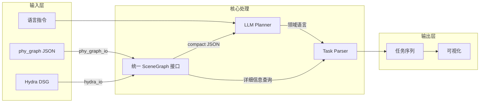

# phy_plan 高层规划框架设计（修订版）

## 架构概览



## 目录结构

```
phy_plan/
├── __init__.py
├── core/
│   ├── __init__.py
│   ├── scene_graph.py          # 统一接口：抽象不同来源的场景图
│   └── task.py                 # 领域语言（Action, TaskSequence）
├── input/
│   ├── __init__.py
│   ├── phy_graph_io.py         # 加载 phy_graph 输出的 JSON（compact/detailed）
│   └── hydra_io.py             # 加载 Hydra DSG（含 place 节点、mesh）
├── planner/
│   ├── __init__.py
│   ├── base.py                 # BasePlanner 接口
│   └── llm_planner.py          # LLM 规划器
├── output/
│   ├── __init__.py
│   └── task_parser.py          # 解析 LLM 输出为结构化任务
├── visualization/
│   ├── __init__.py
│   └── arrangement_viz.py      # 摆放结果可视化（2D matplotlib）
├── prompts/
│   └── arrangement_prompt.txt
├── experiments/
│   ├── __init__.py
│   ├── data/                   # 存放测试用 JSON 文件（从 phy_graph 复制）
│   │   └── scene_graph_office.json
│   └── chair_arrangement.py    # 椅子摆放实验
├── test/                       # 保留现有测试文件不动
│   ├── graphReader.py
│   ├── arrangePolicy.py
│   ├── arranged_test.py
│   └── ...
└── backend/                    # 保留
```

## 封装目的说明

`core/scene_graph.py` 的作用：

- **不是**重复 compact/detailed 转换（phy_graph 已完成）
- **是**提供统一接口，使 planner 和 visualization 模块不关心数据来源
- 两种 IO 源：

  1. `phy_graph_io`：直接加载 JSON，已有 compact 字段
  2. `hydra_io`：从 DSG 加载，包含 place 节点（GVD 图）+ mesh（导航用）

## 椅子摆放实验（简化版）

工作流程：

1. 用户复制 `phy_graph/output/scene_graphs/scene_graph_latest.json` 到 `experiments/data/`
2. 实验代码直接调用 `phy_graph_io.load()` 加载
3. 筛选椅子和桌子，计算目标位置
4. 输出任务序列 + 可视化
```python
# experiments/chair_arrangement.py 示例
from phy_plan.input.phy_graph_io import load_scene_graph
from phy_plan.visualization.arrangement_viz import visualize_arrangement

sg = load_scene_graph("data/scene_graph_office.json")
chairs = sg.get_objects_by_category("chair")
tables = sg.get_objects_by_category("table")
# ... 计算目标位置、输出可视化
```


## 实现步骤

1. 创建目录结构（保留 test/、backend/）
2. 实现 `core/task.py`（领域语言定义）
3. 实现 `core/scene_graph.py`（统一接口）
4. 实现 `input/phy_graph_io.py`（JSON 加载）
5. 实现 `visualization/arrangement_viz.py`（2D 可视化）
6. 实现 `experiments/chair_arrangement.py`（椅子摆放实验）
7. （后续）实现 `input/hydra_io.py`（DSG + place + mesh）
8. （后续）实现 `planner/llm_planner.py`
