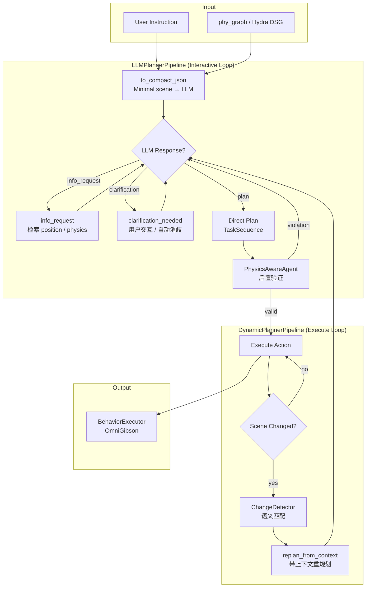

# phy_plan — Physics-Aware LLM Task Planning with Dynamic Scene Graphs

> **首个**结合 VLM 物理属性感知、实时场景图订阅与动态重规划的 LLM 机器人任务规划系统。

[](https://www.python.org/)
[](http://wiki.ros.org/noetic)
[](https://openai.com/)
[](LICENSE)

---

## Highlights

- **Physics-Aware Planning** — VLM 推断物体 `weight_level` / `pushable` / `friction_level`，LLM 生成计划后 Python 快速后置验证，不可行时自动重规划
- **Two-Stage RAG** — Compact JSON 省 token → LLM 按需 `info_request` 检索坐标/物理属性 → 仍有歧义时 `clarification_needed` 请用户澄清
- **Dynamic Replanning** — 通过 Hydra DSG (2 s 周期) 或 phy_graph 实时订阅场景图，`ChangeDetector` 检测任务相关变化，自动触发带上下文重规划
- **Multi-Turn Dialogue** — 对话历史持久化，支持 `info_request` → `clarification_needed` → `physics replan` 多轮交互

---

## Table of Contents

- [Motivation](#motivation)
- [System Architecture](#system-architecture)
- [Key Design Patterns](#key-design-patterns)
- [Available Actions](#available-actions)
- [Project Structure](#project-structure)
- [Quick Start](#quick-start)
- [API Reference](#api-reference)
- [Experiments (IROS 2026)](#experiments-iros-2026)
- [Related Work](#related-work)
- [References](#references)
- [Troubleshooting](#troubleshooting)

---

## Motivation

大多数基于场景图的 LLM 规划系统（ConceptGraphs, DC-SGG, Context-Matters）仅关注**语义理解**：

| 能力 | 传统方法 | phy_plan |
|------|----------|----------|
| "找到杯子并拿过来" | ✅ | ✅ |
| "杯子太重搬不动" | ❌ 生成不可行计划 | ✅ 检测 + 自动重规划 |
| "最靠近会议室的椅子" | ❌ 缺坐标无法推理 | ✅ info_request 检索坐标 |
| 目标物体被人移走 | ❌ 按旧计划执行失败 | ✅ 场景变化检测 + 重规划 |

```
指令: "把桌子推到窗边"

❌ 传统方法:                        ✅ phy_plan:
  1. NAVIGATE → table                 1. PhysicsAwareAgent: pushable=False
  2. PUSH → window                    2. 反馈 LLM: "桌子无法推动"
  ⚠️ 运行时失败                       3. LLM 重规划: 建议替代方案
```

---

## System Architecture

### 五层架构总览

```
┌─────────────────────────────────────────────────────────────────────┐
│                        User Instruction                            │
└────────────────────────────┬────────────────────────────────────────┘
                             ▼
┌─────────────────────────────────────────────────────────────────────┐
│  Layer 1 — Input Adapters                                          │
│  ┌──────────────────┐  ┌──────────────────┐  ┌──────────────────┐  │
│  │  phy_graph_io     │  │  phy_graph_sub   │  │  hydra_io        │  │
│  │  (静态 JSON)      │  │  (ROS 实时订阅)   │  │  (Hydra DSG)     │  │
│  └────────┬─────────┘  └────────┬─────────┘  └────────┬─────────┘  │
│           └──────────────┬──────┘─────────────────────┘            │
└──────────────────────────┼─────────────────────────────────────────┘
                           ▼
┌─────────────────────────────────────────────────────────────────────┐
│  Layer 2 — Unified Data Model                                      │
│  ┌──────────────────────────────────────────────────────────────┐   │
│  │  SceneGraph  ←  RoomNode / ObjectNode / PhysicalProperties   │   │
│  │  ├─ to_compact_json()     → LLM prompt (省 token)            │   │
│  │  ├─ to_compact_json(pos/phy) → RAG 检索 (按需)               │   │
│  │  └─ get_object_by_id()    → 详细信息查询                      │   │
│  └──────────────────────────────────────────────────────────────┘   │
│  ┌───────────────────┐  ┌───────────────────┐                      │
│  │  TaskSequence      │  │  Action / ActionType│                    │
│  │  (领域任务语言)     │  │  (7 种原语动作)     │                    │
│  └───────────────────┘  └───────────────────┘                      │
└──────────────────────────┼─────────────────────────────────────────┘
                           ▼
┌─────────────────────────────────────────────────────────────────────┐
│  Layer 3 — Planning Engine                                         │
│                                                                     │
│  ┌─ LLMPlanner ────────────────────────────────────────────────┐   │
│  │  plan()  → 单轮无状态规划 (自动 reset)                        │   │
│  │  chat()  → 多轮有状态对话                                     │   │
│  │  replan_from_context() → 带上下文重规划                        │   │
│  │  ├─ _build_object_info()  — info_request RAG                  │   │
│  │  ├─ enrich_candidates()   — clarification RAG                 │   │
│  │  └─ parse_response()      — JSON 提取 + 校验                  │   │
│  └──────────────────────────────────────────────────────────────┘   │
│                                                                     │
│  ┌─ LLMPlannerPipeline ────────────────────────────────────────┐   │
│  │  run_interactive()  → 交互式多轮循环                           │   │
│  │  ├─ _handle_info_request()     → 两阶段 RAG 第一步            │   │
│  │  ├─ _handle_clarification()    → 两阶段 RAG 第二步            │   │
│  │  ├─ _try_spatial_resolution()  → 自动空间消歧                  │   │
│  │  ├─ _build_rag_context()       → RAG 上下文 (含 room centroid)│   │
│  │  ├─ _expand_arrange_actions()  → ARRANGE 展开为子动作          │   │
│  │  └─ _pending_response 机制     → 防止冗余 LLM 调用             │   │
│  └──────────────────────────────────────────────────────────────┘   │
│                                                                     │
│  ┌─ DynamicPlannerPipeline ────────────────────────────────────┐   │
│  │  plan_and_execute()  → 规划 + 监控执行循环                     │   │
│  │  ├─ _should_check_scene()          → 场景检查时机判定          │   │
│  │  ├─ _check_and_handle_scene_change() → ChangeDetector 驱动    │   │
│  │  ├─ _handle_failure_replan()       → 执行失败重规划            │   │
│  │  ├─ _handle_scene_change_replan()  → 场景变化重规划            │   │
│  │  ├─ _handle_replan_clarification() → 重规划中处理 clarification│   │
│  │  └─ ARRANGE lazy expansion         → 执行时展开                │   │
│  └──────────────────────────────────────────────────────────────┘   │
│                                                                     │
│  ┌─ Support Modules ───────────────────────────────────────────┐   │
│  │  PhysicsAwareAgent   — 物理约束后置验证 + 替代建议              │   │
│  │  SpatialResolver     — 距离计算 + 自动空间消歧                  │   │
│  │  ChangeDetector      — 语义匹配 (应对 Hydra ID 不稳定)         │   │
│  └──────────────────────────────────────────────────────────────┘   │
└──────────────────────────┼─────────────────────────────────────────┘
                           ▼
┌─────────────────────────────────────────────────────────────────────┐
│  Layer 4 — Execution                                               │
│  ┌──────────────────────────────────────────────────────────────┐   │
│  │  BehaviorExecutor  →  OmniGibson / BEHAVIOR-1K               │   │
│  │  ├─ _navigate_with_feedback()                                 │   │
│  │  ├─ _pick_with_feedback()                                     │   │
│  │  ├─ _place_with_feedback()                                    │   │
│  │  ├─ _place_inside_with_feedback()                             │   │
│  │  ├─ _open_with_feedback()  /  _close_with_feedback()          │   │
│  │  ├─ _observe_with_feedback()                                  │   │
│  │  └─ ARRANGE guard: 未展开则报错                                │   │
│  └──────────────────────────────────────────────────────────────┘   │
│  ┌──────────────────────────────────────────────────────────────┐   │
│  │  core/pipeline.py  (预留) →  通信中间件接口                    │   │
│  └──────────────────────────────────────────────────────────────┘   │
└──────────────────────────┼─────────────────────────────────────────┘
                           ▼
┌─────────────────────────────────────────────────────────────────────┐
│  Layer 5 — Prompt Engineering                                      │
│  ┌──────────────────────────────────────────────────────────────┐   │
│  │  task_planning_prompt.py                                      │   │
│  │  ├─ SYSTEM_CONTENT  — Response Protocol 决策树                 │   │
│  │  │   1. Direct plan                                           │   │
│  │  │   2. info_request  (spatial / physics)                     │   │
│  │  │   3. clarification_needed (user preference)                │   │
│  │  ├─ FEW_SHOT_EXAMPLE  — 6 个示例覆盖典型场景                   │   │
│  │  │   Ex1: 单物体直接规划                                       │   │
│  │  │   Ex2: 多物体澄清                                          │   │
│  │  │   Ex3: 空间推理 info_request → 计划                         │   │
│  │  │   Ex4: 两阶段 RAG (info → clarification + description)     │   │
│  │  │   Ex5: place_inside 容器操作                                │   │
│  │  │   Ex6: arrange 整理操作                                     │   │
│  │  └─ Rules  — 8 条规则 (含 CRITICAL 空间推理优先级)              │   │
│  └──────────────────────────────────────────────────────────────┘   │
└─────────────────────────────────────────────────────────────────────┘
```

### 核心数据流



### Compact JSON vs 详细版本（两级信息策略）

```
Compact (LLM prompt, 省 token)         Detailed (RAG 按需检索)
────────────────────────────────        ────────────────────────────────
{                                       {
  "node_id": "O(13)",                    "node_id": "O(13)",
  "category": "chair",                   "category": "chair",
  "room_id": "R(2)"                      "position": [1.5, 2.0, 0.5],
}                                        "bounding_box": {...},
                                         "physical_properties": {
                                           "weight_level": 1,
                                           "pushable": true,
                                           "friction_level": 1
                                         },
                                         "description": "black mesh chair ;
                                           near(table), left_of(chair) ;
                                           office environment"
                                       }
```

**设计理念**：Compact JSON 仅包含 `node_id` + `category` + `room_id`，大幅节省 token。当 LLM 需要更多信息（空间、物理）时，通过 `info_request` 按需检索。

---

## Key Design Patterns

### 1. Two-Stage RAG（两阶段检索增强生成）

```
Stage 1 — info_request (系统自动)
  LLM 发现需要坐标/物理属性 → 发出 info_request
  → Pipeline 检索 position / physics / room centroid
  → LLM 自行计算距离并决策

Stage 2 — clarification_needed (用户参与)
  info_request 后仍有歧义（如外观相同）
  → Pipeline 用 phy_graph description 丰富候选项
  → 展示给用户选择 (或 SpatialResolver 自动消歧)
```

**示例**: _"把咖啡杯放在最靠近会议室的 swivel chair 上"_

```
[1] LLM → info_request: ["O(27)","O(28)",...,"O(34)"], type="position"
[2] Pipeline → 返回 8 把椅子坐标 + 所有房间质心
[3] LLM → 计算距离, O(31) 最近 → 直接生成 plan (无需用户介入)
```

### 2. _pending_response 机制（防冗余调用）

`_handle_info_request` / `_handle_clarification` / `_try_spatial_resolution` 内部获得 LLM 回复后，将其存入 `self._pending_response`。主循环 `_interactive_loop` 优先消费此 buffer，避免重复调用 LLM。

### 3. 物理约束后置验证

```
LLM 生成 plan → PhysicsAwareAgent.validate_plan()
  ├─ weight_level > robot.max_force  → ❌ 重规划
  ├─ pushable == False               → ❌ 重规划
  └─ all pass                        → ✅ 执行
```

对比 PDDL 前置约束：无需领域建模，prompt 修改即可迭代。

### 4. ChangeDetector 语义匹配

Hydra DSG 的 `node_id` 在不同帧可能不稳定。`ChangeDetector` 通过 `(category, position)` 语义匹配替代 ID 直接比较，确保变化检测的鲁棒性。

### 5. ARRANGE 惰性展开

`ARRANGE` 是高层动作（如"整理椅子"），在 `LLMPlannerPipeline` 用户确认后、或 `DynamicPlannerPipeline` 执行时才展开为 `NAVIGATE → PICK → PLACE` 子动作序列。`BehaviorExecutor` 内设防御：如果收到未展开的 `ARRANGE`，立即报错。

### 6. plan() vs chat() 状态隔离

| 方法 | 状态 | 用途 |
|------|------|------|
| `plan()` | 无状态，调用前自动 `reset()` | 单轮规划、基线测试 |
| `chat()` | 有状态，累积对话历史 | 交互式多轮对话 |
| `replan_from_context()` | 有状态，延续当前对话 | 动态重规划 |

---

## Available Actions

| Action | Params | Description |
|--------|--------|-------------|
| `navigate` | `room_id` | 导航到指定房间 |
| `pick` | `object_id` | 拾取物体 |
| `place` | `object_id`, `surface_id` | 放在表面**上方** (place_on_top) |
| `place_inside` | `object_id`, `container_id` | 放入容器**内部** (需先 open) |
| `open` | `object_id` | 打开容器/门 |
| `close` | `object_id` | 关闭容器/门 |
| `arrange` | `object_category`, `room_id` | 整理同类物体 (高层，自动展开) |

```json
// place vs place_inside
{"action": "place", "params": {"object_id": "O(5)", "surface_id": "O(10)"}}
{"action": "open", "params": {"object_id": "O(20)"}}
{"action": "place_inside", "params": {"object_id": "O(3)", "container_id": "O(20)"}}
```

---

## Project Structure

```
phy_plan/
├── core/                          # Data model & support modules
│   ├── agent.py                   # LLM Agent (plan / chat / reset)
│   ├── scene_graph.py             # SceneGraph / RoomNode / ObjectNode
│   ├── task.py                    # Action / ActionType / TaskSequence
│   ├── physics_agent.py           # PhysicsAwareAgent (post-validation)
│   ├── change_detector.py         # ChangeDetector (semantic matching)
│   └── pipeline.py                # (reserved) communication middleware
├── input/                         # Input adapters
│   ├── phy_graph_io.py            # Static JSON loader
│   ├── phy_graph_subscriber.py    # ROS subscriber + file fallback
│   └── hydra_io.py                # Hydra DSG loader (GVD places)
├── planner/                       # Planning engine
│   ├── llm_planner.py             # LLMPlanner (core planning logic)
│   ├── llm_planner_pipeline.py    # Interactive pipeline (Two-Stage RAG)
│   ├── dynamic_planner.py         # Dynamic replan pipeline (execute loop)
│   └── spatial_resolver.py        # Distance-based spatial disambiguation
├── executor/                      # Execution layer
│   ├── behavior_executor.py       # OmniGibson / BEHAVIOR-1K interface
│   └── behavior_action_api.py     # Low-level action API wrapper
├── prompts/                       # Prompt engineering
│   ├── task_planning_prompt.py    # System prompt + few-shot examples
│   └── prompt_gen.py              # Prompt generation utilities
├── visualization/                 # Visualization
│   └── arrangement_viz.py         # 2D arrangement visualization
├── utils/                         # Utilities
│   ├── assignment.py              # Hungarian algorithm + TSP
│   └── arrangement.py             # Position generation
└── experiments/                   # Experiments & demos
    ├── interactive_demo.py        # Interactive planning demo
    ├── task_demo.py               # Single-shot planning demo
    ├── physics_aware_demo.py      # Physics-aware demo
    ├── iros_experiments.py        # IROS 2026 benchmark framework
    └── data/                      # Test scene graphs
```

---

## Quick Start

### Prerequisites

```bash
pip install -r requirements.txt
export OPENAI_API_KEY='sk-xxx'
```

### Interactive Planning (Offline)

```bash
cd /path/to/phy_plan
python phy_plan/experiments/interactive_demo.py \
    --scene=scene_graph_enhanced.json \
    --enable-physics --debug
```

### Interactive Planning (ROS)

```bash
# Terminal 1: launch phy_graph
roslaunch phy_graph inference.launch

# Terminal 2: interactive planner
python phy_plan/experiments/interactive_demo.py --ros
```

### Expected Interaction

```
================================================================
Interactive Planning Demo
Physics-Aware Planning: ENABLED
================================================================

please enter task instruction: Place the coffee cup on the swivel chair closest to the conference room.

[planning] instruction: Place the coffee cup on the swivel chair closest to the conference room.
[Pipeline] LLM requested info for: ['O(27)', 'O(28)', ..., 'O(34)']
[Pipeline] Providing info:
  - swivel_chair (O(27)) Position: [1.21, -2.50, 0.49] Room: R(4)
  - ...
  - Room ConferenceRoom (R(3)) centroid: [-4.29, 8.09, 1.79]

[planning completed] generated 4 actions:
  1. [navigate] Navigate to R(3)
  2. [pick] Pick up O(18) (coffee_cup)
  3. [navigate] Navigate to R(4)
  4. [place] Place O(18) on O(31) (swivel_chair)

execute this plan? (y/n):
```

### Single-Shot Planning

```bash
python phy_plan/experiments/task_demo.py \
    --scene phy_plan/experiments/data/scene_graph_1.json \
    --instruction "去小房间拿咖啡杯到大会议室，然后整理椅子"
```

---

## API Reference

### SceneGraph & Input

```python
from phy_plan.input.phy_graph_subscriber import SceneGraphSubscriber

# File mode
subscriber = SceneGraphSubscriber.from_file("scene.json")
scene_graph = subscriber.get_latest()

# ROS mode
subscriber = SceneGraphSubscriber(topic="/phy_graph/scene_graph_full")
scene_graph = subscriber.get_latest()
```

### LLMAgent (Multi-Turn)

```python
from phy_plan.core.agent import LLMAgent

agent = LLMAgent(model="gpt-4o-mini")
agent.init_conversation("You are a robot task planner.")
response = agent.chat("Pick up the red cup.")
agent.reset()
```

### Interactive Pipeline

```python
from phy_plan.planner.llm_planner_pipeline import LLMPlannerPipeline

pipeline = LLMPlannerPipeline(scene_file="scene.json", enable_physics=True)
task_seq = pipeline.run_interactive(initial_instruction="拿水杯")
```

### Dynamic Pipeline

```python
from phy_plan.planner.dynamic_planner import DynamicPlannerPipeline

dynamic = DynamicPlannerPipeline(
    pipeline=pipeline,
    subscriber=subscriber,
    use_conversation_mode=True
)
success = dynamic.plan_and_execute(instruction="把杯子放到桌上")
```

---

## Experiments (IROS 2026)

### Research Questions

| RQ | Question | Method |
|----|----------|--------|
| RQ1 | VLM 物理推断是否提升规划成功率？ | vs 无物理验证 baseline |
| RQ2 | 动态重规划是否提高环境适应性？ | 动态场景任务成功率 |
| RQ3 | 后置验证 vs PDDL 前置约束哪个更优？ | 规划效率对比 |

### Environment

| Component | Choice | Rationale |
|-----------|--------|-----------|
| Simulator | OmniGibson + BEHAVIOR-1K | Reproducible, IROS 2025 MORE benchmark |
| Scene Graph | Hydra DSG / phy_graph | Real-time dynamic updates |
| LLM | GPT-4o-mini / GPT-4o | Cost-performance balance |
| Robot | Fetch / Tiago (sim) | BEHAVIOR-1K default |

### Task Suites (16 tasks)

**A. Physics Constraint Tasks (8)**

| Task | Challenge | Expected Behavior |
|------|-----------|-------------------|
| `pick_heavy_box` | weight_level=2 | Detect & reject / suggest alternative |
| `push_fixed_table` | pushable=False | Report immovable |
| `carry_fragile_cup` | Delicate handling | Adjust grasp force |
| `move_stacked_objects` | Multi-object dependency | Correct sequencing |
| `pick_slippery_item` | friction_level=low | Adjust grasp strategy |
| `lift_oversized_object` | Exceeds gripper range | Report infeasible |
| `rearrange_heavy_chairs` | Mixed weights | Select operable objects |
| `clear_cluttered_desk` | Multiple physics | Prioritize light objects |

**B. Dynamic Scene Tasks (4)**

| Task | Scene Change | Expected Behavior |
|------|-------------|-------------------|
| `track_moving_cup` | Target moved by human | Detect + replan |
| `object_disappear` | Target removed | Report + request instruction |
| `new_obstacle_appear` | Path blocked | Update plan |
| `room_layout_change` | Furniture relocated | Re-locate target |

**C. Multi-Turn Dialogue Tasks (4)**

| Task | Ambiguity Type | Expected Behavior |
|------|---------------|-------------------|
| `pick_ambiguous_cup` | Multiple same-category | Clarification + RAG |
| `spatial_reference` | "Nearest chair" | info_request → compute |
| `constraint_feedback` | User picks heavy object | Feedback + suggest alternative |
| `multi_step_clarify` | Complex instruction | Step-by-step confirmation |

### Baselines

| Method | Description | Purpose |
|--------|-------------|---------|
| **Ours (Full)** | Complete phy_plan | Upper bound |
| **Ours w/o Physics** | Remove PhysicsAwareAgent | Validate physics value |
| **Ours w/o Dynamic** | Remove ChangeDetector | Validate replan value |
| **Ours w/o VLM** | Fixed rules vs VLM inference | Validate VLM value |
| **LLM-only** | Pure LLM, no scene graph | Lower bound |

### Metrics

```python
metrics = {
    "success_rate":          "Task completion rate (%)",
    "physics_violation_rate": "Physics constraint violations (%, lower=better)",
    "replan_accuracy":       "Replan trigger accuracy (%)",
    "avg_llm_calls":         "Average LLM calls per task",
    "avg_planning_time":     "Average planning time (s)",
    "recovery_rate":         "Failure recovery rate (%)",
}
```

---

## Related Work

| Project | Perception | Planning | Dynamic | Physics |
|---------|-----------|----------|---------|---------|
| **phy_plan (Ours)** | Hydra DSG (2s real-time) | LLM + physics validation | Multi-turn + dynamic replan | weight / friction / pushable |
| [ConceptGraphs](https://concept-graphs.github.io/) | Open-vocab 3D SG | — | Offline | — |
| [DovSG](https://github.com/gaoalexander/DovSG) | Open-vocab + explore | — | Partial | — |
| [DC-SGG](https://github.com/joyhsu0504/DC-SGG) | LLaVA captioning | PDDL | Single-shot | — |
| [LLM-SG-LTL](https://github.com/Charlie0257/LLM-Scene-Graph-LTL-Planning) | Manual SG | LTL + STL | Single-shot | — |
| [Context-Matters](https://github.com/Learning-and-Intelligent-Systems/context-matters) | Image captions | LLM → PDDL | Single-shot | — |
| [SpatialLM](https://github.com/zsyzzsoft/SpatialLM) | Point cloud + LLM | 3D QA | — | — |

### Why not PDDL?

- **Flexibility**: LLM understands natural language directly; no domain modeling
- **Fast iteration**: Modify prompt, not domain/problem files
- **Dynamic replan**: Just re-call LLM; no PDDL recompilation
- **Tradeoff**: No formal guarantee (mitigated by physics post-validation)

### Why Hydra over Open-Vocabulary?

- **Maturity**: Validated in ICRA/IROS/RSS publications
- **Real-time**: 2s update cycle vs offline processing
- **Focus**: We focus on planning-layer innovation, not perception

---

## References

1. **Hydra** — RSS 2022 | MIT SPARK Lab — [[Paper](http://arxiv.org/abs/2201.13360)] [[Code](https://github.com/MIT-SPARK/Hydra)]
2. **ConceptGraphs** — ICRA 2024 | MIT CSAIL — [[Paper](https://arxiv.org/abs/2309.16650)] [[Project](https://concept-graphs.github.io/)]
3. **Context Matters** — CoRL 2024 | MIT CSAIL — [[Paper](https://arxiv.org/abs/2410.02823)] [[Code](https://github.com/Learning-and-Intelligent-Systems/context-matters)]
4. **DC-SGG** — ICRA 2024 | Stanford — [[Code](https://github.com/joyhsu0504/DC-SGG)]
5. **DovSG** — IROS 2024 | CMU — [[Code](https://github.com/gaoalexander/DovSG)]
6. **SpatialLM** — NeurIPS 2023 Workshop | Tsinghua — [[Code](https://github.com/zsyzzsoft/SpatialLM)]
7. **Khronos** — Temporal DSG (Hydra extension) — [[Code](https://github.com/MIT-SPARK/Khronos)]

---

## Troubleshooting

<details>
<summary><b>No scene graph loaded</b></summary>

```bash
# File mode: check file exists
ls phy_plan/experiments/data/scene_graph_1.json

# ROS mode: check node & topic
rosnode list | grep phy_graph
rostopic echo /phy_graph/scene_graph_full --noarr
```
</details>

<details>
<summary><b>API key not found</b></summary>

```bash
echo $OPENAI_API_KEY
export OPENAI_API_KEY='sk-xxx'
```
</details>

<details>
<summary><b>ImportError: No module named rospy</b></summary>

```bash
# Option A: use file mode (no ROS needed)
python phy_plan/experiments/interactive_demo.py

# Option B: source ROS environment
source /opt/ros/noetic/setup.bash
```
</details>

<details>
<summary><b>LLM returns invalid JSON</b></summary>

```python
# Use a stronger model
agent = LLMAgent(model="gpt-4o")

# Or reduce scene graph size
compact_json = scene_graph.to_compact_json(max_objects=50)
```
</details>

<details>
<summary><b>Scene changes not triggering replan</b></summary>

```python
# Debug: check hashes
print(f"Previous: {self._previous_scene_hash}")
print(f"Current: {current_hash}")
```
</details>

---

## Module Completion

| Module | Status | Coverage |
|--------|--------|----------|
| `core/scene_graph.py` | ✅ Unified interface + compact JSON + RAG | 100% |
| `core/physics_agent.py` | ✅ 13 methods, full validation | 100% |
| `core/change_detector.py` | ✅ Semantic matching for ID instability | 100% |
| `core/task.py` | ✅ Complete task definition | 100% |
| `planner/llm_planner.py` | ✅ LLM planning + clarification + RAG | 100% |
| `planner/llm_planner_pipeline.py` | ✅ Interactive pipeline + Two-Stage RAG | 100% |
| `planner/dynamic_planner.py` | ✅ Dynamic replan + scene change + failure recovery | 100% |
| `planner/spatial_resolver.py` | ✅ Distance-based spatial disambiguation | 100% |
| `executor/behavior_executor.py` | ✅ 22 methods, BEHAVIOR integration | 100% |
| `input/phy_graph_subscriber.py` | ✅ ROS subscribe + file fallback | 100% |
| `input/hydra_io.py` | ✅ Hydra DSG loader | 100% |
| `experiments/iros_experiments.py` | ⚠️ Framework ready, needs live runs | 70% |

---

## License

MIT License. See [LICENSE](LICENSE) for details.
